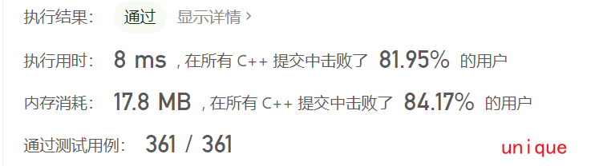

## 26删除有序数组中的重复项

> leetcode:[26. 删除有序数组中的重复项](https://leetcode.cn/problems/remove-duplicates-from-sorted-array/)

## 解法1-有点作弊好吧

~~~cpp
class Solution {
public:
    int removeDuplicates(vector<int>& nums) {
        return unique(nums.begin(), nums.end()) - nums.begin(); 
    }
};
~~~

> https://cplusplus.com/reference/algorithm/unique/?kw=unique

这个函数的作用是将迭代器区间内重复的元素移动到末尾，然后返回一个不重复最末端的迭代器

~~~
1 1 2 2 2 3 3 
处理后
1 2 3 1 2 2 3
返回↑的迭代器
和begin一减便是题目要求的长度
~~~

---

## 解法2-双指针

这里就用迭代器替代了

当快的和慢的不相等，慢的**后一位**替换成快的值即可

注意返回值需要+1，不然会少一位

~~~cpp
class Solution {
public:
    int removeDuplicates(vector<int>& nums) {
        if(nums.size()<2)
            return nums.size();
        
        vector<int>::iterator it1 = nums.begin();
        vector<int>::iterator it2 = nums.begin()+1;
        while(it2!=nums.end())
        {
            if(*it2!=*it1){
                *(it1+1)=*it2;
                it1++;
            }
            it2++;           
        }
        return it1-nums.begin()+1;
    }
};
~~~

